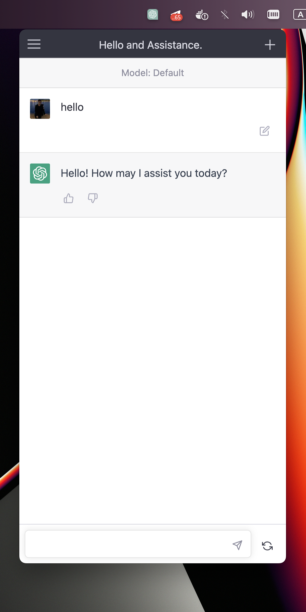

# ChatGPT Desktop App

This is a simple desktop app tray for [ChatGPT](https://chat.openai.com/chat).

## Build

1. Install dependencies with `npm i` or `yarn`
2. Build the app with `npm run make` or `yarn make`
3. Check the files in the `out/make` folder

## Usage

### Keyboard Shortcuts:

- Quit: `Command+Q`
- Reload: `Command+R`
- Toggle Full Screen: `Ctrl+Command+F`

## Screenshot

## Contributing

Contributions are welcome! If you find a bug or want to suggest an enhancement, please open a new issue
